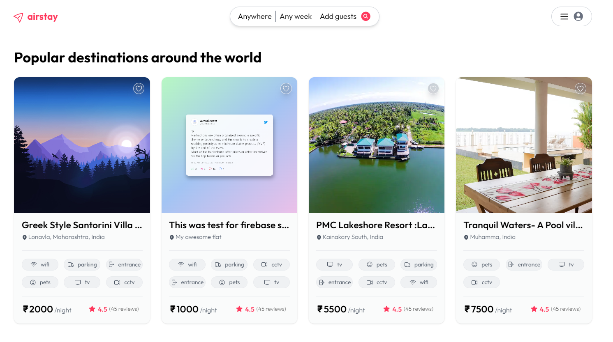

# Airstay: an Airbnb clone project



This repository is dedicated to Airstay, an Airbnb clone project. Airstay allows users to browse and book accommodations, view detailed information about each place, manage bookings, and list accommodations for rent.

## Technologies used to build

### Frontend (Client)

- [React](https://react.dev/): A JavaScript library for building user interfaces.
- [React Router DOM](https://www.npmjs.com/package/react-router-dom): Declarative routing for React.
- [Axios](https://www.npmjs.com/package/axios): Promise-based HTTP client for the browser and Node.js.
- [Framer Motion](https://www.npmjs.com/package/framer-motion): Convex is a Backend Application Platform that keeps you focused on building your product. Convex Functions, Database, File Storage, Scheduling, and Search fit together cohesively
- [TailwindCSS](https://tailwindcss.com/): A utility-first CSS framework for streamlined web application styling.
- [Lucide React](https://www.npmjs.com/package/lucide-react): A collection of simply beautiful open-source icons.

### Backend (API)

- [Express](https://www.npmjs.com/package/express): Fast, unopinionated, minimalist web framework for Node.js.
- [Mongoose](https://www.npmjs.com/package/mongoose): MongoDB object modeling for Node.js.
- [JWT (JSON Web Tokens)](https://www.npmjs.com/package/jsonwebtoken): Securely transmitting information between parties as a JSON object.
- [bcryptjs](https://www.npmjs.com/package/bcryptjs): A library to help hash passwords.
- [Multer](https://www.npmjs.com/package/multer): Middleware for handling multipart/form-data.

## Key Features

- **Browse and Book Accommodations:** Users can browse through available accommodations and book their preferred places.
- **Detailed Place Information:** Clicking on each place opens a detailed page with title, description, and photos.
- **Booking Window:** Users can select dates and provide details for booking accommodations.
- **User Authentication:** Users can sign in or sign up using the user button in the top right corner.
- **User Dashboard:** After signing in, users have access to their profile, bookings, and accommodations.
- **My Bookings:** Users can view all their bookings.
- **My Accommodations:** Users can list their accommodations for rent and manage them.
- **Add/Edit Accommodations:** Users can add new accommodations or edit existing ones through a form.

## Project Structure

The project root repository consists of two main directories:

1. **API:** Contains the backend code built with Express, MongoDB, and related dependencies.

2. **Client:** Contains the frontend code built with React, along with necessary dependencies.

## Setting Up the Applications Locally

Before running the Airstay application locally, you'll need to set up both the backend API and the frontend client.

### Backend (/api)

#### Prerequisites

- Node.js installed on your system
- MongoDB installed and running
- Firebase service account key
- Your MongoDB URL
- JWT secret key

#### Cloning the Repository

```bash
git clone https://github.com/your-username/airstay.git
```

#### Installing Dependencies

```bash
cd api
yarn install
```

#### Setting Up Environment Variables

Create a .env file in the api directory and add the following environment variables:

```bash
FIREBASE_SERVICE_ACCOUNT_KEY=your-firebase-service-account-key
MONGO_URL=your-mongodb-url
JWT_SECRET=your-jwt-secret
```

#### Running the API

```bash
yarn start
```

### Frontend (/client)

#### Installing Dependencies in Client

```bash
cd client
yarn install
```

#### Setting Up Environment Variables in Client

Make sure to update the **axios.defaults.baseURL** in *client/src/App.tsx* file with your deployed API URL.

#### Running the Client

```bash
yarn dev
```

Now, you can navigate to <http://localhost:3000> in your browser to access the Airstay application.

## Credits

Special thanks to *Coding with David* for his invaluable tutorial, which served as the foundation for building this app. You can find the tutorial [here](https://www.youtube.com/watch?v=MpQbwtSiZ7E).

Feel free to explore and contribute to the project!
